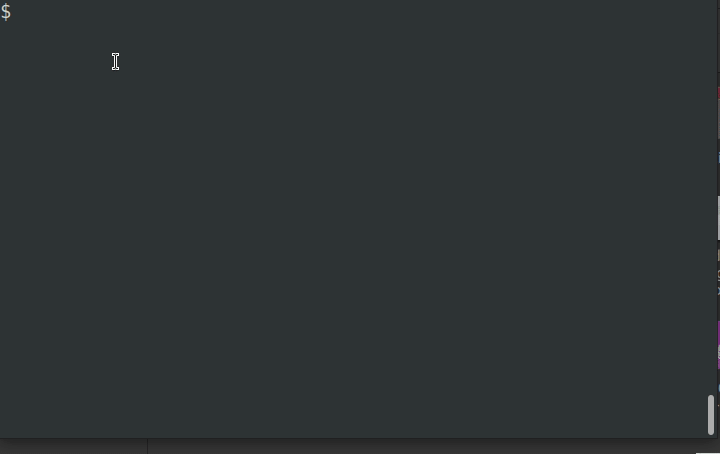

<div align="center">


# TSK - The Scripting Kit

Truly Standalone Scala Scripts on Linux and Mac.


</div>

Make your Scala programs instantly runnable just by prepending it with a special (IDE / tooling neutral) preamble.
The program becomes a self-installable-and-executable shell script,
that everybody can run on their systems without any prerequisites.


The preamble (shell commands disguised as Scala comments) ensures that the prerequisites (everything needed to compile and execute
the Scala program) get first downloaded and then used to run the program. Caching is used to skip unnecessary downloads and recompilations
after the program has been run already.


The users of the scripts don't need to install or even know about JVM, SBT or any of the common tooling related to Scala programming.
This makes TSK-powered scripts ideal for situations in which Scala would be normally rejected because of the installation complexity
and set up overhead.



## Example

Say you've got some unstructured text file containing URL addresses and that you need to extract unique URLs.
Maybe you thought about using grep for that - but on a closer inspection URLs are quite involved beasts,
with all the query parameters, escaping etc. the regular expression may be difficult to get right
(let alone the readability of the end result). You would be better off using some proper URL validation method,
as typically found in programming languages. Ideally the programming language would be suitable for scripting,
so it's straightforward to write and run a program without having to fight tooling / dependencies.


Luckily Scala is one of the languages in which URL validation is available within the standard library
(via Java SDK) and with help of this project it is well suited for scripting as well. You can make a runnable
URLGrep script using Scala and TSK in a couple of minutes by following the steps below:

1. Save the following snippet into `URLGrep.scala` file:
```scala
// 2> /dev/null; source $(curl -sL https://git.io/boot-tsk | sh); run; exit

object URLGrep {

  def main(args: Array[String]) = {
    val urls = for {
      line  <- io.Source.stdin.getLines()
      token <- line.split("\\s+")
      clean <- token.split("[\"']")
      if util.Try(new java.net.URL(clean)).isSuccess
    } yield clean
    urls.toSet.toSeq.sorted.foreach(println)
  }

}
```
2. Set the executable bit: `chmod +x URLGrep.scala`

Voilà! Your script is ready for running. Pipe some text to its standard input to try it out:
```shell
echo something something http://google.com | ./URLGrep.scala
curl https://scala-lang.org | ./URLGrep.scala
```

The first run may take quite long because TSK needs to download several dependencies in the background first.
Depending on the internet connection it may be even a couple of minutes. The second and next runs will be quick, because
everything is cached on disk already.

One nice thing is that no matter on which Linux or Mac system you run it, it will work, as long they have `curl` or `wget` installed.
Think - you can pass that script to your coworkers, it'll work without any cumbersome tool installation needed.
The same for Docker containers - as long the image has `curl` / `wget`, your program will work there.

The above example is meant to whet your appetite by demonstrating some useful basics,
but the real fun begins with external libraries that can come from both public and company-private repositories.

Make sure you glance over the features section and also see [the wiki](https://github.com/tsk-tsk/tsk-tsk/wiki) for more examples.

## Main features

- Minimal prerequisites - apart from a working internet connection you only need `wget` or `curl`.
- The simplest possible workflow: you write the script, and you make it executable. That's it.
The initial script run downloads those of the required dependencies that don't exist on the machine yet.
- Regular Scala, without any syntax that'd confuse standard tooling (editable without red squiggles in IntelliJ IDEA).
When your script grows somewhat, but not to a degree when it'd need a full-blown project, split it into separate files
with all Scala constructs (like packages) working as expected
- Use all Scala and Java libraries you need or want, as long they are in a maven or ivy repository (internal corporate
repositories requiring credentials and/or proxies are supported as well)
- support for:
  - macOS (tested on AppVeyor, also had some positive user reports)
  - fresh Docker images of the following Linux distributions:
    - out of the box: alpine, archlinux, fedora (they've got `curl` / `wget`)
    - after you install `curl`: debian, ubuntu
  - most likely your Linux distribution even without root permissions as long you've installed `curl` or `wget`
- Experimental support for Ammonite scripts (use `run_with_ammonite` instead of `run`)

## Planned features

- Customizable JVM version (at the time 1.8 is used)
- Easy migration to a full-blown Scala project when the script grows.
The script is valid Scala so the existing tooling handles it perfectly well - the TSK-specific parts are hidden
from the Scala compiler within the Scala comment block. TSK will be able to generate SBT and Mill projects
- Robust error handling

## Acknowledgements

TSK stands on the shoulders of giants. Kudos to all authors and contributors of the following technologies:

- Scala, which is my favorite programming language
- Ammonite, the best Scala REPL, which also pioneered Scala scripting capabilities
- Coursier, which made it super-easy to manage Scala and Java dependencies
- Bloop, which provides great compilation and IDE interoperation features
- Unix, with fantastic scripting capabilities

## Special thanks

- To that ScalaPolis2016 attendee, who noticed, that it's possible for a file to be both valid Scala and valid shell.
- To those of the ScalaPolis2016 and FunctionalTricity 28.04.2016 attendees, who have appreciated my points and to those who made fun of them.
I enjoyed our conversations very much :)
- To the wonderful organizers of the mentioned events for having me and for still wanting me to speak! ;)
